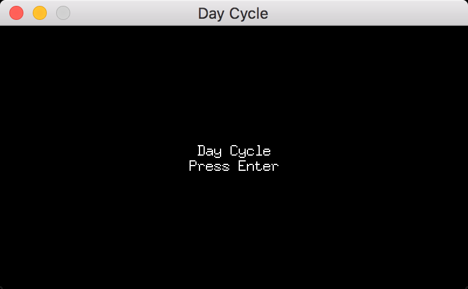

# Sketch: Day Cycle

[](https://goreportcard.com/report/github.com/miketmoore/sketch-daycycle)

This started as a way to learn about the state pattern and to work with the pixel game engine.

Press enter to cycle through the phases of one day.



## Run

```
go run cmd/daycycle/daycycle.go
```

## References

* Names for parts of the day: https://english.stackexchange.com/questions/28498/precise-names-for-parts-of-a-day
* Color palette: https://color.adobe.com/Gray-Moon-color-theme-480267/edit/?copy=true
